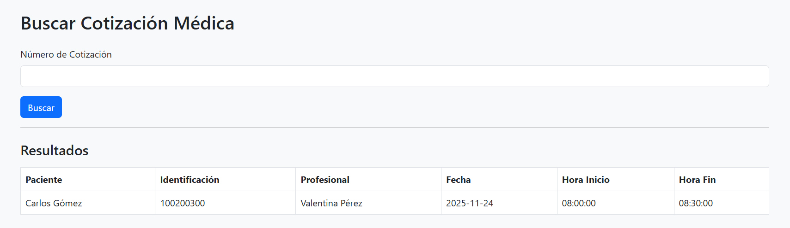

# GUÍA DE CONFIGURACIÓN

Este documento describe la arquitectura de la base de datos para el flujo clínico (Quote-to-Appointment) y los pasos iniciales para poner el proyecto en funcionamiento (asumiendo un entorno Laravel).

---

## CONFIGURACIÓN INICIAL DEL PROYECTO (Laravel)

Siga estos pasos para clonar y ejecutar la aplicación localmente:

### 1. Clonar el Repositorio

Abra su terminal o línea de comandos y clone el proyecto:

```bash
git clone https://github.com/Jose-Daniel-G/pacific
cd pacific
```
 **configurar credenciales en el archivo .env**
DB_CONNECTION=pgsql
DB_HOST=127.0.0.1
DB_PORT=5432
DB_DATABASE=pacific
DB_USERNAME=postgres
DB_PASSWORD=
- *IMPORTANTE EJECUTAR* : php artisan migrate --seed
```bash
composer install
cp .env.example .env
php artisan key:generate
php artisan migrate --seed
php artisan serve
npm run dev
```
* Solo hay dos numeros de cotizacion 1 y 2, con sus reapectivas fechas y hora de inicio y fin

# VISIÓN GENERAL DEL SISTEMA Y 

* Pacientes
* Profesionales de salud
* Cotizaciones
* Órdenes médicas
* Medicamentos
* Flux de admisión
* Calendarios
* Eventos (fechas)
* Slots (horarios)
* Citas agendadas

El objetivo final del programa es:
**Tomar una cotización y obtener la cita agendada (día y hora) con el doctor asociado.**

Para eso se usa una consulta SQL muy larga que atraviesa **TODAS** las tablas del sistema.

---

## 1. ENTIDADES PRINCIPALES (Pacientes y Profesionales)

**Tabla: `gbl_entity`**
Aquí se guardan todos los usuarios del sistema, tanto pacientes como médicos.

Atributos importantes:

* `first_name`, `last_name`
* `identification`
* `entity_type`"patient" o "doctor"

---

## 2. COTIZACIONES Quotation

**Tabla: `com_quotation`**
Una cotización representa una solicitud de servicios/medicamentos.

### 2.1 Quotation Line $\rightarrow$ Aqui es donde se encuentra el detalle de la cotizacion

**Tabla: `com_quotation_line`**
Cada línea es un detalle:

* "Consulta general"
* "Medicamento X"
* "Procedimiento Y"

Una cotización puede tener muchas líneas.

### ORDEN MÉDICA

A partir de una línea de cotización, se genera una orden médica.

---

## 3. Medical Order $\rightarrow$ Orden médica

**Tabla: `cnt_medical_order`**
Contiene la instrucción médica general.

### 3.1 Medicament Order $\rightarrow$ Medicamentos en la orden

**Tabla: `cnt_medical_order_medicament`**
Ejemplo:

* Amoxicilina 500mg
* Ibuprofeno 400mg

### 3.3 Relación entre línea de cotización y medicamento

**Tabla: `cnt_medical_order_medicament_quotation`**

Une:

* Línea de cotización (`line_id`)
* Medicamento en orden médica (`cnt_medical_order_medicament_id`)

---

## 4. ADMISIÓN DEL PACIENTE

Una orden médica genera un flujo de admisión.

### 4.1 Admisión

**Tabla: `adm_admission`**
Liga un paciente (`patient_entity_id`) con un estado clínico.

### 4.2 Flujo de admisión

**Tabla: `adm_admission_flow`**
Dice en qué etapa está la atención del paciente.

### AGENDAMIENTO

El sistema agenda automáticamente una cita con un profesional.

---

## 5. Calendario del profesional

**Tabla: `sch_calendar`**
Indica los calendarios del médico.

### 5.2 Eventos de calendario

**Tabla: `sch_event`**
Cada fila es un rango de fechas donde el profesional trabaja.

### 5.3 Slot

**Tabla: `sch_slot`**
Es un horario específico dentro del evento, ej:

* 08:00 – 08:30
* 08:30 – 09:00

### 5.4 Slot asignado al paciente

**Tabla: `sch_slot_assigned`**
Se asigna un slot a un paciente.

### 5.5 Workflow slot

**Tabla: `sch_workflow_slot_assigned`**
Conecta el flujo de admisión con un horario disponible.

### 5.6 Cita final

**Tabla: `adm_admission_appointment`**
Relaciona:

* Admisión
* Slot final asignado

La consulta:

* Busca por ID de la cotización
* Y hace un recorrido de **TODAS LAS TABLAS**
    hasta encontrar:
    * el paciente,
    * el doctor,
    * la fecha,
    * y la hora de la cita asignada.

Es como seguir un hilo desde una cotización hasta la cita.

---

# RESUMEN FINAL

El sistema completo hace esto:

* Cotizas algo (servicio o medicamento).
* Esa cotización genera órdenes médicas.
* Las órdenes médicas activan un flujo de admisión.
* La admisión crea una cita con un profesional.
* Se agenda un slot dentro del calendario del médico.
* La consulta SQL obtiene la información final de la cita.

Es un sistema clínico REAL, bastante completo y muy bien estructurado.

---

## CÓMO SE CONECTA TODO (RESUMEN DEL FLUJO)

1.  La cotización tiene líneas
    `com_quotation` $\rightarrow$ `com_quotation_line`

2.  Cada línea se asocia a un medicamento de orden médica
    `com_quotation_line` $\rightarrow$ `cnt_medical_order_medicament_quotation` $\rightarrow$ `cnt_medical_order_medicament` $\rightarrow$ `cnt_medical_order`

3.  La orden médica pertenece a un flujo de admisión
    `cnt_medical_order` $\rightarrow$ `adm_admission_flow` $\rightarrow$ `adm_admission`

4.  La admisión genera una cita
    `adm_admission` $\rightarrow$ `adm_admission_appointment` $\rightarrow$ `sch_workflow_slot_assigned` $\rightarrow$ `sch_slot_assigned`

5.  El slot asignado conecta al paciente con un doctor
    `sch_slot_assigned.entity_id` = paciente
    `sch_calendar.entity_id` = doctor

6.  Finalmente se obtiene
    * Nombre del paciente
    * Nombre del doctor
    * Fecha (`init_date`)
    * Hora inicio / fin

    